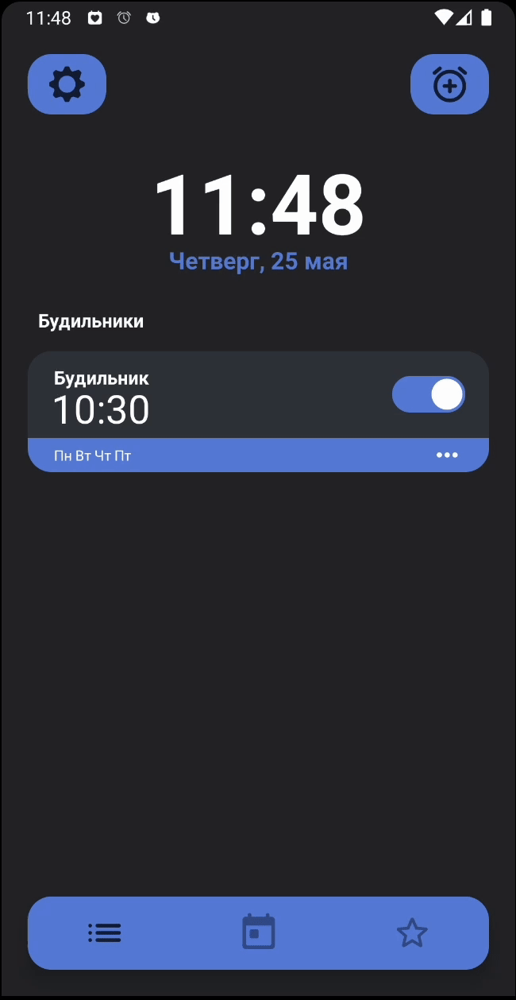
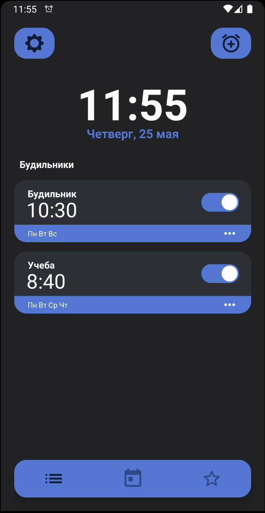

# SuppleClock - Умный будильник

## О проекте
**SuppleClock** — это умный будильник для Android, который помогает пользователям просыпаться вовремя, используя гибкие настройки и различные способы отключения.

## Технологии
- **Язык**: `Java 11`
- **Архитектура**: `MVVM`
- **База данных**: `Android Room`, `SQLite`

## Функциональность

### Будильники
Приложение позволяет создать два типа будильника: простой и гибкий. Простой будильник срабатывает каждый день, гибки настраивается на каждый день недели отдельно.

Каждыому будильнику можно задать количество раз, сколько можно его отложить на небольшое время.

Функция "Обязательно проснуться" потребует от пользователя решения задачи для отключения будильника, среди них: тряска телефона, зажатие кнопок громкости, написание фразы.

Функция "Утреннее время" позволяет проснуться раньше, и быть собранным в намеченное время.

### Основные экраны
- **Главный экран**: список всех будильников с возможностью включения/выключения, редактирования и удаления.
  
- **Экран календаря**: отображает запланированные будильники.
  
- **Экран достижений**: мотивирует пользователя следить за своим режимом сна.
  
- **Экран настроек**:
  - Напоминания ложиться спать.
  - Цель сна и вечернего отдыха.
  - Период дополнительного утреннего времени.
  - Настройки способов отключения обязательных будильников.

### Создание будильника

### Настройки приложения

### Отключение будильника

